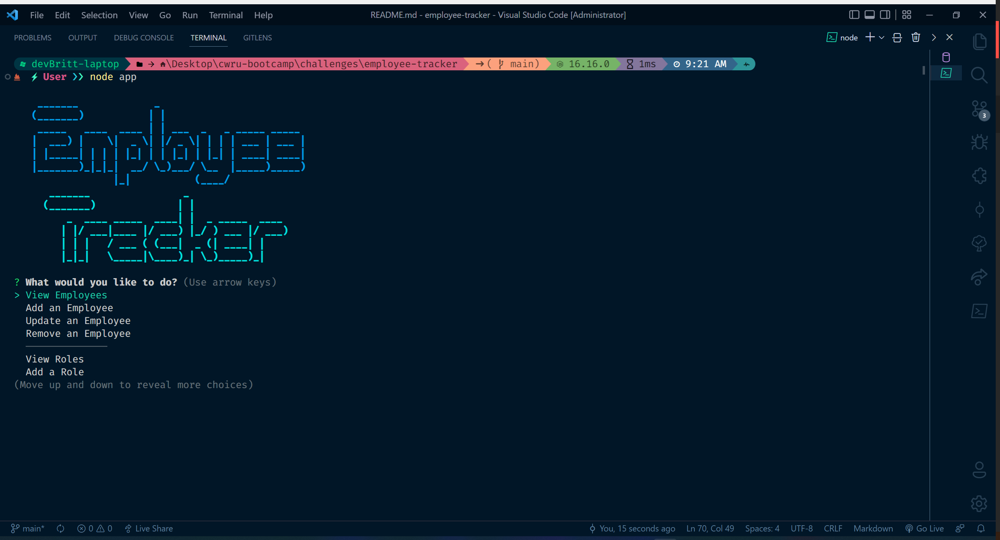

<h1 align='center'>

**Employee Tracker**

<!-- LICENSE BADGE -->

<!-- DEPENDENCIES BADGES -->

</h1>

Employee Tracker is a conent management system (CMS) that runs through a command line interface (CLI). It allows users to easily view and interact with a company's employee database. It can be used to retrieve or update information about specific employees. In addition, the user can view and update details about company departments and employee roles.

 
<h2 align='center'>

**Table of Contents**
</h2>

&nbsp;&nbsp;&nbsp;&nbsp;

 

### Usage
---
***Note***: You will need to have MySQL installed on your system in order to use this app.

***To install the Employee Tracker, use one of the following methods.***  
Method 1: Download

1. Download the zip file
2. Unzip the file into a new folder wherever you would like the application to live

Method 2: Clone

In the terminal:

    $ git clone git@github.com:devBritt/employee-tracker.git

 

**Once one of the above methods has been completed**, navigate to the application folder in your terminal and run `$ npm i` to install the required packages. You will then have to create and populate the database using the db.sql file provided. You can do this by executing the command `$ mysql -u 'username' -p`, replacing 'username' with the username you set when you installed MySQL. Input your password when prompted and finally, use `$ source db/db.sql` to create your database! The last required step is to update the `configsTemplate.js` file. Change the file name to `configs.js` and update the username and password to reflect your MySQL user.

***Customization***
If you would like to use your own departments, roles, and employees, you can update the `seeds.sql` file with your data. Following the format inside the () following the name of the table you would like to edit, delete any rows you don't need, copy and paste to add more, and change the values inside the () following the `values` clause.

 

***To use the application, navigate to its root directory and run this command:***  
    
    $ node index

Congrats! You are now running the Employee Tracker app!

 

### Demo
---
[Employee Tracker](https://youtu.be/VSQql7FRQ8Y)

 

### Lessons
---
As this was the first challenge that utilizied MySQL to create a database, there was a lot of trial and error, particularly when it came to writing queries. There were two queries that were particularly difficult to write. The first was the select query to retrieve a list of all employees with the names of their managers combined into one column. After some research, I was able to find the `CONCAT_WS` operation. The second difficult query was for retrieving the total payroll budget for each department. Having to combine a sum selector, multiple joins, and a where clause made for a fairly complicated query that took some tweaking to get working.
